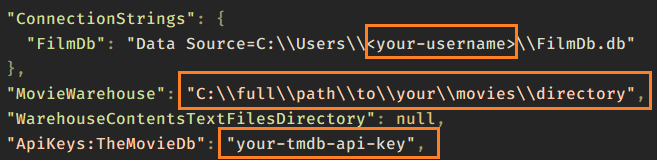

[](https://github.com/mvcb01/filmdepot/actions/workflows/ci.yaml)

# filmdepot

<!-- TABLE OF CONTENTS -->
<details>
  <summary>Table of Contents</summary>
  <ol>
    <li>
      <a href="#about-the-project">About The Project</a>
    </li>
    <li>
      <a href="#getting-started">Getting Started</a>
      <ul>
        <li><a href="#prerequisites">Prerequisites</a></li>
        <li><a href="#installation">Installation</a></li>
      </ul>
    </li>
    <li><a href="#usage">Usage</a></li>
    <li><a href="#license">License</a></li>
    <li><a href="#acknowledgments">Acknowledgments</a></li>
  </ol>
</details>


<!-- ABOUT THE PROJECT -->
## About The Project

Simple CLI manager to interact with your local movie collection. Useful for data hoarders.

* parse your movie files into Title, Release Date, rip quality and rip group
* search [The Movie Database API](https://developers.themoviedb.org/3/getting-started/introduction) and link movie rips to movies
* get genres, cast members, directors, keywords and IMDB ids of the movies in your collection
* show aggregated data related to the movies rips and the movies they are linked to
* keep track of changes over time

<p align="right">(<a href="#readme-top">back to top</a>)</p>

<!-- GETTING STARTED -->
## Getting Started

### Prerequisites

* Windows 10
* [sqlite3](https://www.sqlite.org/download.html)
* [.NET 6 SDK or above](https://dotnet.microsoft.com/en-us/download/dotnet/6.0). The .NET runtime is not sufficient since currently the only automated installation is building from source.

### Installation

1. Clone the repo
    ```powershell
    git clone https://github.com/mvcb01/filmdepot.git
    ```
2. Install dependencies
    ```powershell
    dotnet restore
    ```
3. Run the ps scripts in the _DeploymentScripts directory
    ```powershell
    cd .\_DeploymentScripts\
    .\1_DeployLocally.ps1
    .\2_GenerateMigrationScripts.ps1
    .\3_RunMigrationScripts.ps1
    ```

4. Save the contents of your `PATH` environment variable in a text file in your home directory
    ```powershell
    cd ~
    echo $env:PATH > PATH_backup.txt
    ```

5. Add the newly created directory `C:\Users\<your-username>\filmdepot_PROD` to your `PATH` environment variable. Follow what's in [To add a path to the PATH environment variable](https://learn.microsoft.com/en-us/previous-versions/office/developer/sharepoint-2010/ee537574(v=office.14)). If you mess it up just restore `PATH` using the text file from step 4.

6. Restart powershell and type this:
    ```powershell
    filmcrud --help
    ```
    You should see the help menu:

    

7. [Get a key for The Movie Database API](https://developers.themoviedb.org/3/getting-started).

8. Edit the following configs in `C:\Users\<your-username>\filmdepot_PROD\appsettings.json`

    

<p align="right">(<a href="#readme-top">back to top</a>)</p>


<!-- USAGE EXAMPLES -->
## Usage

Use this space to show useful examples of how a project can be used. Additional screenshots, code examples and demos work well in this space. You may also link to more resources.

_For more examples, please refer to the [Documentation](https://example.com)_

<p align="right">(<a href="#readme-top">back to top</a>)</p>

<!-- LICENSE -->
## License

Distributed under the MIT License. See `LICENSE.txt` for more information.

<p align="right">(<a href="#readme-top">back to top</a>)</p>

<!-- ACKNOWLEDGMENTS -->
## Acknowledgments

* [The Movie Database API](https://developers.themoviedb.org/3/getting-started/introduction)

<p align="right">(<a href="#readme-top">back to top</a>)</p>